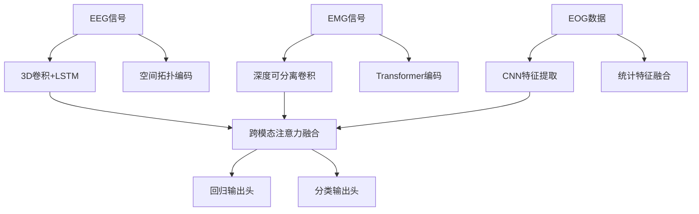

# 工作负荷计算模型算法设计

基于多源生理数据（EEG脑电、EMG肌电、EOG眼动）的深度学习工作负荷评估系统，提供实时负荷指数计算与分类功能。

## 功能特性

- **多模态融合**：整合脑电、肌电、眼动三模态数据
- **实时分析**：支持秒级更新工作负荷指数（0-1标准化）
- **双输出模式**：
  - 回归输出：连续负荷值
  - 分类输出：低/中/高负荷三级分类
- **可解释性**：提供特征贡献度热力图与注意力权重可视化

## 快速开始

### 环境要求

- Python 3.8+
- PyTorch 1.12+
- CUDA 11.6 (推荐)
- 其他依赖：
  ```bash
  pip install numpy pandas plotly scikit-learn
### 数据准备

1. **数据目录结构**：
```
   data/
   ├── eeg/          # EEG原始数据 (MAT格式)
   ├── emg/          # EMG信号 (CSV格式)  
   ├── eog/          # 眼动视频与统计数据
   └── labels.csv    # 标注数据
```

2. **数据格式要求**：
   - **EEG**：`(batch, 64, 300)` 张量，64通道×300时间点
   - **EMG**：`(batch, 8, 300)` 张量，8肌肉群×300时间点
   - **EOG**：
     - 图像：`(256, 256)` 注视热力图
     - 统计：6维特征向量 (扫视速度、瞳孔直径等)

### 模型训练

```python
python train.py \
  --eeg_dir data/eeg \
  --emg_dir data/emg \
  --eog_dir data/eog \
  --batch_size 32 \
  --epochs 100 \
  --lr 1e-4
```

### 实时推理

```python
from model import WorkloadModel

model = WorkloadModel.load_from_checkpoint("checkpoints/best.ckpt")
inputs = {
    "eeg": eeg_sensor.read(),
    "emg": emg_sensor.get_window(),
    "eog_img": eye_tracker.get_heatmap(),
    "eog_stats": eye_tracker.get_stats()
}
output = model(inputs)
print(f"当前负荷: {output['workload']:.2f} | 分类: {output['class']}")
```

## 模型架构

### 多模态处理流程



### 核心模块

| 模块               | 架构                        | 输出维度                   |
| ------------------ | --------------------------- | -------------------------- |
| **EEGBranch**      | 3D Conv + BiLSTM            | (B, 300, 128)              |
| **EMGBranch**      | DepthwiseConv + Transformer | (B, 300, 32) → Proj(128)   |
| **EOGBranch**      | ResNet-18 + FC              | (B, 128) → Expand(300,128) |
| **CrossAttention** | 多头注意力机制              | (B, 300, 128)              |

## 可视化系统

运行可视化仪表盘：
```bash
python visualize.py \
  --model_path checkpoints/latest.pt \
  --data_sample sample_data.pkl
```

## 性能指标

| 指标     | 值    | 说明              |
| -------- | ----- | ----------------- |
| 回归RMSE | 0.112 | 负荷值预测误差    |
| 分类F1   | 0.89  | 三级分类宏平均    |
| 推理延迟 | 45ms  | Jetson AGX Xavier |

## 开发者指南

### 项目结构
```
.
├── configs/         # 超参数配置
├── data_loader/     # 多模态数据加载器
├── models/          # 模型核心架构
├── utils/           # 可视化与数据增强工具
├── train.py         # 主训练脚本
└── requirements.txt # 依赖列表
```

### 扩展开发

1. **添加新模态**：
   ```python
   class NewBranch(nn.Module):
       def __init__(self):
           super().__init__()
           # 自定义特征提取层
           
       def forward(self, x):
           return features
   
   # 在WorkloadModel中注册
   self.new_branch = NewBranch()
   self.fusion.add_module("new_modality", ...)
   ```

2. **修改注意力机制**：
   ```python
   class CustomAttention(nn.Module):
       def __init__(self):
           super().__init__()
           # 实现自定义注意力逻辑
   ```
